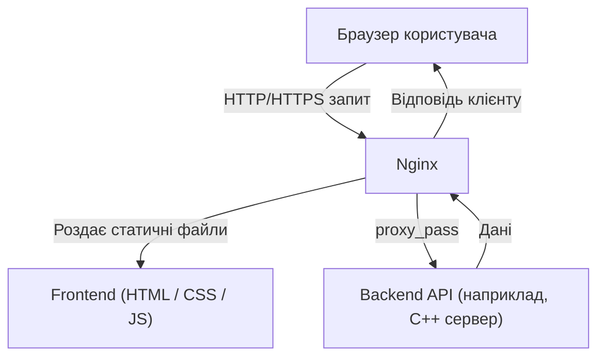
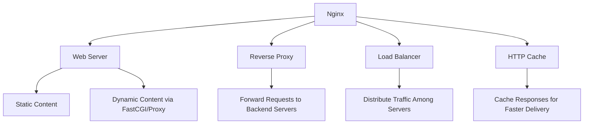

# Nginx

Nginx - це дуже швидкий "посередник",  
який роздає веб-сторінки, зображення, файли, або пересилає запити до інших сервісів (наприклад, backend-API).

### Приклад схеми роботи

Як читати цю схему:
1. Користувач відкриває сайт — запит іде до Nginx.
2. Якщо файл статичний (наприклад, index.html, app.js), Nginx віддає його одразу.
3. Якщо запит — до API (/api/...), Nginx пересилає його (proxy_pass) на бекенд.
4. Backend повертає дані назад через Nginx до користувача.

### Основні можливості Nginx:
1. Веб-сервер (static server) - Роздає статичні файли (HTML, CSS, JS, зображення) напряму користувачу.
2. Reverse Proxy - Приймає запити і передає їх на інший сервер (наприклад, твій C++ backend). Це дозволяє сховати внутрішню інфраструктуру.
3. Load Balancing - Розподіляє навантаження між кількома серверами — щоб один не перевантажувався.
4. Cache (кешування) - Зберігає копії відповідей, щоб не навантажувати бекенд однаковими запитами.
5. SSL/TLS termination - Обробляє HTTPS-шифрування, щоб не робити це на backend-сервері.
6. Reverse proxy for APIs / microservices - Ідеально підходить для проксирування запитів до мікросервісів.
7. Gzip / Brotli compression - Стискає відповіді для швидшої передачі.
8. Redirects і Rewrites - Може перенаправляти трафік або змінювати URL перед обробкою.
9. Rate limiting & Security - Обмежує кількість запитів від клієнтів для захисту від DDoS.
10. HTTP/2, WebSocket, gRPC support - Підтримує сучасні протоколи для кращої продуктивності.
11. Logging & Monitoring - Веде access/error-логи, які можна інтегрувати з Prometheus, Grafana тощо.
12. Modular architecture - Має багато модулів для розширення функціоналу (наприклад, Lua скрипти).
13. Virtual hosts - Підтримує кілька сайтів на одному сервері (наприклад, example.com і example.org).
14. Reverse proxy buffering - Буферизує запити/відповіді для кращої продуктивності.

### Приклад схеми роботи Nginx як багатоцільового сервера

